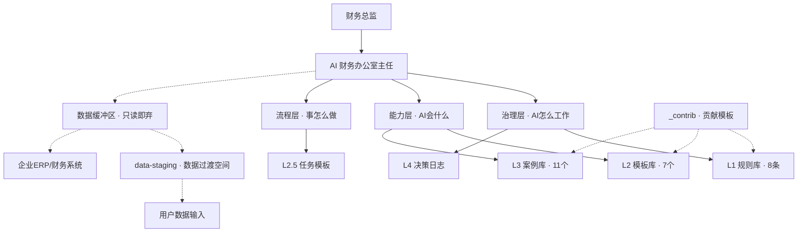

<div align="center">


# 🏦 FinanceOS

### AI 财务操作系统 —— 让任何 AI 平台都成为你的财务总监助手

**Dual-Axis Cognitive Operating System for Enterprise Finance**

[English](#) | [快速开始](#快速开始) | [架构设计](docs/architecture.md) | [贡献指南](CONTRIBUTING.md)

</div>

---

## 这是什么？

**FinanceOS** 是一个为 AI 设计的"财务操作系统"——一套结构化的指令集和知识库，让 ChatGPT、Claude、WorkBuddy 或任何 AI 平台都能像一个真正的财务总监助手那样工作。

不是又一个财务分析工具。**是一套让 AI "学会"财务总监工作方式的操作系统。**

### 核心创新：双轴认知模型

```
角色轴（谁会做什么）× 生命周期轴（事情怎么做）= 工位矩阵
```

每个财务任务都在这个矩阵上自动编排——谁该在哪个阶段做什么，什么时候停、什么时候问、什么时候交付。

---

## 为什么需要 FinanceOS？

| 痛点 | FinanceOS 怎么解决 |
|------|------------------|
| AI 做财务分析不专业、漏步骤 | 5 阶段生命周期 + 4 项强制校验，保证分析闭环 |
| 每次都要重写 prompt | 一次加载系统指令，AI 自动按框架工作 |
| 敏感数据安全不可控 | L1 规则库内置脱敏标准 + STOP gate 机制 |
| 经验无法复用 | L3 案例库 + L4 决策日志，好的方法沉淀、错的教训记录 |
| 不同 AI 平台指令不通用 | 一份核心指令集，适配器支持各平台 |

---

## 快速开始

### 30 秒上手

1. 打开 [`core/FINANCEOS_SYSTEM.md`](core/FINANCEOS_SYSTEM.md)
2. 复制全部内容
3. 粘贴到你用的 AI 平台的系统提示/指令区：

| 平台 | 怎么设置 |
|------|---------|
| **ChatGPT** | Custom GPT → Instructions → 粘贴 → 上传 `kb/` 文件夹到 Knowledge |
| **Claude** | Project → Set custom instructions → 粘贴 → 添加 `kb/` 文件到 Project knowledge |
| **WorkBuddy** | 安装 `adapters/workbuddy/SKILL.md` |
| **通用** | 粘贴到 System Prompt，手动提及 `kb/` 目录 |

4. 对 AI 说：**"帮我做月度经营分析"**

### 完整安装

```bash
git clone https://github.com/YOUR_USERNAME/financeos.git
cd financeos
# 阅读 docs/getting-started.md 了解领域适配
```

---

## 架构一览



---

## 仓库结构

```
financeos/
├── core/
│   └── FINANCEOS_SYSTEM.md     ← 核心指令集（平台无关）
├── kb/                          ← 知识库（通用国企财务领域）
│   ├── _contrib/                # 社区贡献模板（降低贡献门槛）
│   ├── L1-rules/                # 红线规则（8条：脱敏、权限、阈值、输出、资金、成本、监管、科目）
│   ├── L2-templates/            # 报告/表格模板（7个：月度、季度、专项、董事会、资金、公文格式、现金流分析）
│   ├── L2.5-task-templates/     # 高频任务预设编排
│   ├── L3-cases/                # 历史处理经验（11个案例）
│   └── L4-decision-logs/        # 决策记录模板
├── data-staging/                ← 数据过渡空间（非ERP用户输入通道）
│   ├── templates/               # CSV数据模板（预算表、利润表、资产负债表）
│   └── input/                   # 放入待处理数据（已加入.gitignore）
├── adapters/                    ← 各 AI 平台适配器
│   ├── workbuddy/
│   ├── chatgpt/
│   ├── claude/
│   └── generic/
├── docs/                        ← 文档
│   ├── architecture.md
│   ├── getting-started.md
│   ├── dual-axis-model.md
│   └── domain-adaptation.md
├── examples/                    ← 领域示例
│   └── water-utility/
├── CONTRIBUTING.md              ← 贡献指南
└── LICENSE                      ← MIT
```

---

## FinanceOS 适合谁？

- 🏢 **企业财务总监 / CFO**：把工作方法编码为 AI 可执行的系统，提升团队效率
- 📊 **财务分析师**：让 AI 辅助完成月度/季度/年度经营分析报告
- 🔧 **AI 开发者**：学习"角色化工具集"范式，构建领域专用的 AI 操作框架
- 🏛️ **国企/大型企业**：结构化合规管控、决策留痕、知识沉淀

---

## 设计哲学

> **存逻辑不存事实、能调度不包办、边使用边升级。**

- AI 只拥有规则、模板、经验——不拥有你的财务数据
- AI 主任只调度不替你判断——该停的地方一定会停下来问你
- 新增场景不改核心只加流程——框架稳定，领域内容可替换

---

## 贡献

FinanceOS 是一个社区驱动的开源项目。我们欢迎各种形式的贡献：

- 📝 **贡献 KB 内容**：为你的行业添加 L1/L2/L3 条目
- 🔌 **贡献适配器**：为新 AI 平台编写适配器
- 🐛 **报告问题**：发现 bug 或改进建议
- 📖 **改进文档**：让更多人能快速上手

详见 [CONTRIBUTING.md](CONTRIBUTING.md)

---

## 许可证

MIT License © 2026 Sun Jun (孙俊) and FinanceOS Contributors

---

## 致谢

FinanceOS 的灵感来源于企业架构实践、角色化 Agent 设计范式，以及无数财务总监在月末深夜对着一张张报表的坚持。

<div align="center">

**Made with ❤️ by finance people, for finance people.**

[⬆ 回到顶部](#financeos)

</div>
